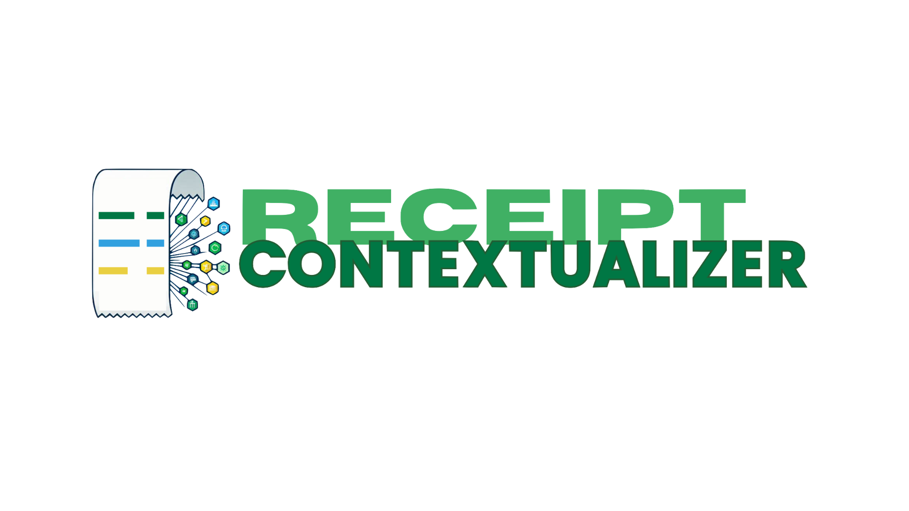
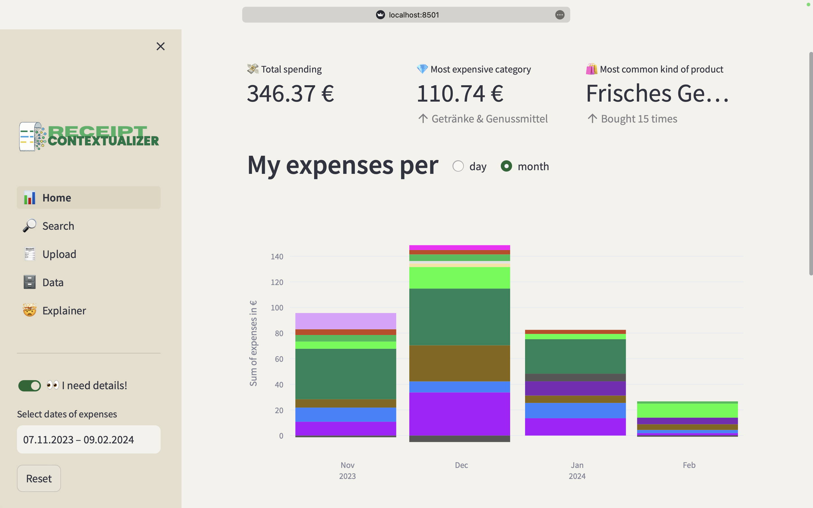

## This is the Capstone Project of the Data Science Bootcamp [Neue Fische | school and pool for digital talent](https://github.com/neuefische) by [Leo Kamps](https://github.com/leokam), [Jakob Butlewski](https://github.com/kubaBigos) and [Tobias Pötzl](https://github.com/TopAudioData).

### Our Presentation at the Graduation Event you could find at YouTube:
https://www.youtube.com/watch?v=c0mJM13bJv8




**Make receipts speak.**

Receipt data is messy. RECEIPT CONTEXTUALIZER augments abbreviations and brand names on receipts into supermarket product categories. It harnesses information in large language models with prompt engineering and provides a semantic search with text embeddings. A beautiful dashboard allows you to get granular insight into your grocery expenses and make informed spending decisions.




This is a functioning prototype built on streamlit. It uses the Google Cloud Vision API and Mistral API, as well as a PostgreSQL database. See setup below.

### Home dashboard


https://github.com/TopAudioData/receipt-contextualizer/assets/36531614/ea22e535-84f9-4309-b9eb-0b3d65127104


The dashboard gives you an overview over your spendings. In the sidebar you can select the timeframe you're interested in and the analytics will adapt. Hover the cursor over the bar charts to see more detailed information.

- Metrics at a glance
    - Total spendings sum
    - Highest spendings category
    - Most often bought kind of product
- Vertical bar charts
    - Expenses per month
    - Expenses per month colored by main category
    - Expenses per day
    - Expenses per day colored by main category
- Horizontal bar charts
    - Expenses per main category
    - Expenses per main category, colored by subcategory (kind of product)
- Tables
    - Sums of expenses grouped by month and main category

### Semantic search


https://github.com/TopAudioData/receipt-contextualizer/assets/36531614/8a8fef36-af1d-4d73-adcd-06c2dc3fd78b


The search tab lets you search for products in your receipt history with natural language. Check out the explainer on how that works.

You can also search for products available at REWE.

### Data


https://github.com/TopAudioData/receipt-contextualizer/assets/36531614/a842a6ab-baf8-437c-aaf0-d1e05d3cc937


See your receipt history all in one place. It also shows you what data was scanned from your receipts and what data is the result of augmentation with a large language model. You can use the table to sort by different columns and download the data as a CSV file.

### Upload


https://github.com/TopAudioData/receipt-contextualizer/assets/36531614/44930af8-a343-4d72-ac31-ce99c563c548


On the upload page you can upload your receipt scans. Select one or multiple files to upload, see where text was recognized and send your receipts off to be augmented, before saving them to your local database.

## Limitations

Current limitations
- Parsing OCR'd receipts information
    - Only tested for REWE receipts
    - Produces errors separating price from item
    - Price information for single item is dismissed for multiple items of the same kind
    - Discounts are currently not associated with the item that was discounted
- Mistral API rate limit to 5 requests per minute slows down data augmentation considerably

## Setup

Open a terminal and `cd` into this repo.

Unzip the data folder

```bash
unzip data.zip
```

### APIs

The current version of RECEIPT CONTEXTUALIZER uses the Google Cloud Vision API and the Mistral API. Allow your instance of RECEIPT CONTEXTUALIZER to connect to both with the following steps.

Create necessary files and directories.

```bash
touch .env
```

```bash
mkdir SA_key
```

Create a GCP project and a service account, download and save the JSON in the directory `SA_key`, and activate the [Cloud Vision API](https://console.cloud.google.com/marketplace/product/google/vision.googleapis.com). You can find help on how to create a project and a service account [here](https://support.google.com/a/answer/7378726).

Create an API-key on Mistral AI's [La Platforme](https://console.mistral.ai).

Open the `.env` file and A. enter your Mistral API key and B. your GCP service account's filename into the path.

```bash
MISTRAL_API_KEY="<your_mistral_api_key>"
GOOGLE_SA_KEY="SA_key/<name_of_your_API_key>.json"
```

### Database

This prototype runs on a PostgreSQL vector database. If you don't have an instance running, you can set up a local database with the following steps.

If you choose a different PostgreSQL instance, change the standard username and password in the database.py script.

Install PostgreSQL with [Homebrew](https://brew.sh). 

```bash
brew install postgresql@14
```
Install [Docker](https://www.docker.com/get-started/).

Create a `receipts` database container by running:

```bash
docker build -t postgres .
```
```bash
docker run -d -e POSTGRES_USER='postgres' \
    -e POSTGRES_PASSWORD='postgres' \
    -e POSTGRES_DB='receipts' \
    -v $(pwd)/db-data:/var/lib/postgresql/data \
    -p 5432:5432 \
    --name receipts-db \
    postgres
```

Start the database container

- Open the Docker dashboard and click the play icon at the `receipts` container.
- This step has to be repeated if your machine was idle.

### Python environment

Create a new python environment and install the requirements.

```bash
pyenv local 3.11.3
python -m venv .venv
source .venv/bin/activate
pip install --upgrade pip
pip install -r requirements.txt
```

### Insert Rewe products for search

Run the database.py script to initialize the tables and insert REWE products for semantic search into database.

```bash
python database.py
```

### Use the interface

Start RECEIPT CONTEXTUALIZER by running

```bash
streamlit run home.py
```
